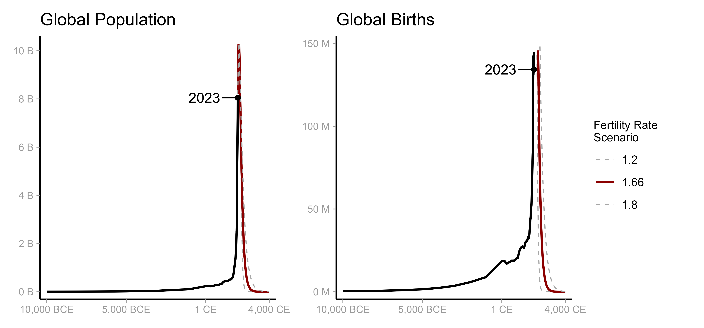

# A spike in world history

<!-- badges: start -->
<!-- badges: end -->

Trying to recreate figure 1 in [Spears et al (2023)](https://papers.ssrn.com/sol3/papers.cfm?abstract_id=4534047). The title of the figure is "Global population as a spike in world history." 

Here's the result:

